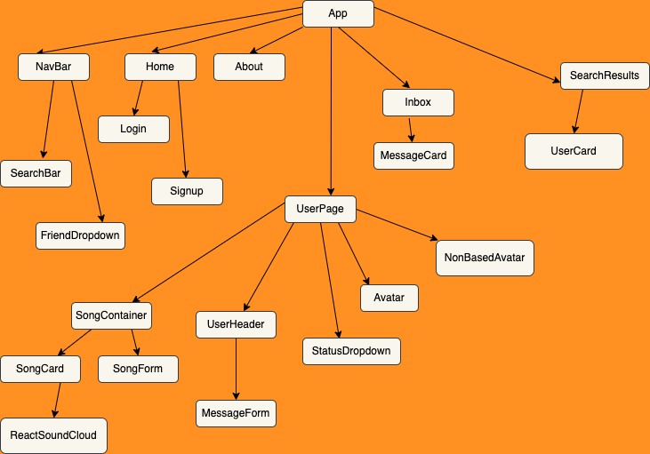
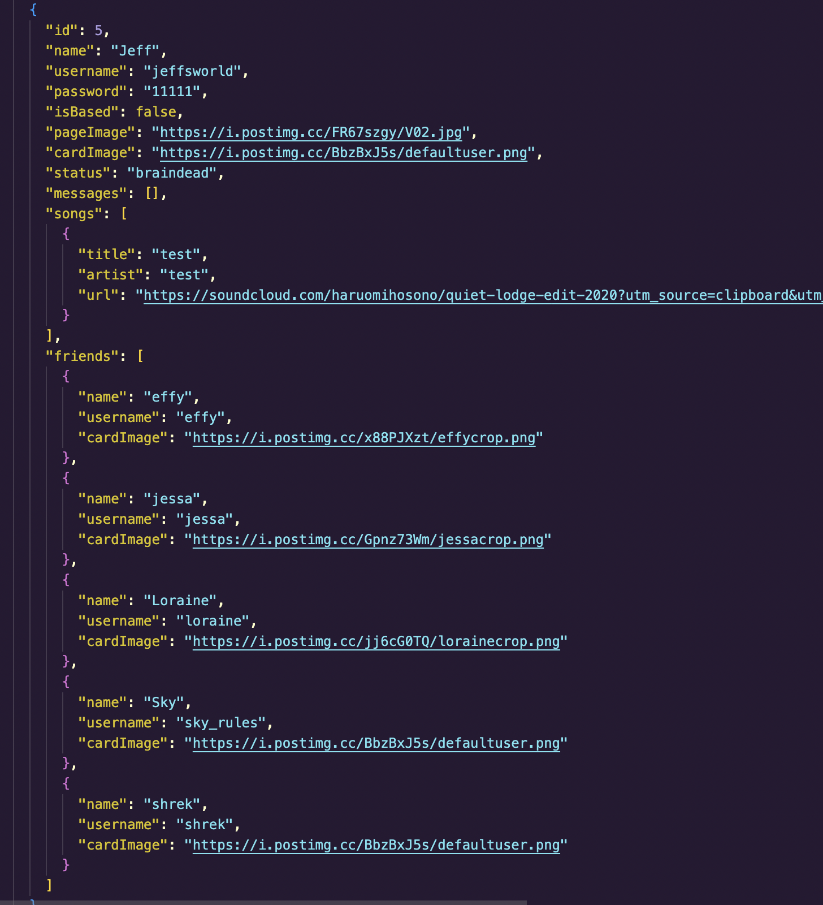

# Friend Hop

This project was manufactured with React, JSX, Bulma.io CSS Framework, and a lot of really fun, sleepness nights. 

## What is it?
This project is a social media emulator where a user 
can share uploaded song links (via soundcloud), add and view friends, send messages and express themselves with preset custom avatar moods.  

### A snippet from our about page: 
We are a social media emulator, bringing back the nostalgia of 2009 animation classics, while supporting a place to save and share your favorite songs of the week. 

Friend hop also supports custom moods for your avatar and uploads of embedded music links. 

 

### `Diagram of Our Component Tree `
 

 
  

### `Captures of our db.json `
